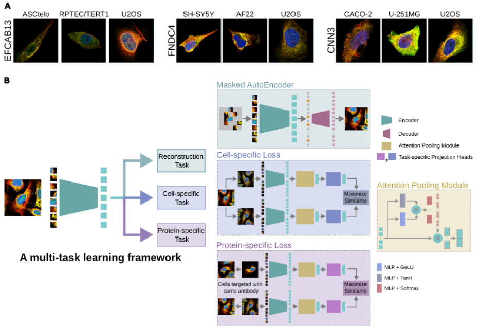

# SubCell: Vision foundation models representing cell biology in microscopy    

## Overview
The cell is the functional unit of life, capable of performing a wide range of biological functions underpinned by a myriad of molecular interactions carefully organized in an intricate subcellular architecture. Cellular architecture   can be studied with microscopy images  at scale, and the present era of machine learning has enabled data-driven modeling of these images to reveal the cellular organization and function beyond what humans can readily perceive. Here, we introduce SubCell, a suite of self-supervised deep learning models designed to accurately capture cellular morphology and protein localization in fluorescent microscope images. The models were trained using the metadata-rich, proteome-wide image collection from the Human Protein Atlas. SubCell outperforms state-of-the-art  methods in protein localization and cellular phenotyping. SubCell is generalizable to other fluorescent datasets  spanning different imaging devices and resolutions, including a dataset of perturbed cells, where SubCell succeeds in predicting perturbations and mechanisms of action without any fine-tuning. Finally, we use SubCell to construct the first proteome-wide hierarchical map of proteome organization directly learned from image data.   



*Figure 1: Overview of the SubCell self-supervised learning framework. (A) Representative images of single-cell crops from the Human Protein Atlas data set demonstrating the diverse cell morphologies and protein subcellular localizations present in a variety of human cells (Blue: Nucleus; Red: Microtubules; Yellow: endoplasmic reticulum; Green: Protein of interest). (B) Figure 1Illustration depicting our multi-task learning approach to train a vision transformer model. We use three tasks to train our model: reconstruction, cell-specific, and protein-specific tasks.*


## Repository Structure
```
subcell/
├── annotations/
│   ├── splits/
│   │   ├── test_antibodies.txt
│   │   ├── train_antibodies.txt
│   │   └── valid_antibodies.txt
│   └── location_group_mapping.tsv
├── configs/
│   ├── cellS-protS.yaml
│   ├── cellS.yaml
│   ├── MAE-cellS-protS-byol.yaml
│   ├── MAE-cellS-protS-contrast.yaml
│   ├── MAE.yaml
│   └── protS.yaml
├── data/
│   ├── collate_fn.py
│   ├── dataset.py
│   └── get_datasets.py
├── models/
│   ├── backbone.py
│   ├── heads.py
│   └── losses.py
├── training/
│   ├── trainer.py
│   └── optimizer.py
├── utils/
│   ├── trainer.py
│   └── optimizer.py
└── train.py

```

## Installation
```bash
# Clone the repository
git clone https://github.com/username/subcell-embed.git
cd subcell-embed

# Create conda environment
conda create -n subcell python=3.8
conda activate subcell

# Install requirements
pip install -r requirements.txt
```

## Requirements
```
torch>=2.1.2
pytorch-lightning>=2.2
transformers>=4.41.0
torchmetrics==1.3.0
mosaicml-streaming==0.7.3
```

## Usage

### 1. Data Preparation
```python
from src.data.preprocessors import BioDataPreprocessor

preprocessor = BioDataPreprocessor(
    input_path="path/to/raw/data",
    output_path="path/to/processed/data",
    modality="protein"
)
preprocessor.process()
```

### 2. Training
```bash
# Train with default configuration
python scripts/train.py

# Train with custom configuration
python scripts/train.py --config-name=custom_config.yaml
```

### 3. Configuration Example
```yaml
# configs/default_config.yaml
model:
  name: "bio_ssl"
  backbone: "resnet50"
  projection_dim: 128
  temperature: 0.07

data:
  batch_size: 256
  num_workers: 4
  modality: "protein"
  augmentations:
    - "random_crop"
    - "random_flip"
    - "random_rotation"

training:
  max_epochs: 100
  learning_rate: 0.001
  weight_decay: 1e-4
  optimizer: "adam"
  scheduler: "cosine"
```

## Key Features

### Data Processing
- Support for multiple biological data modalities
- Customizable data augmentation pipeline
- Efficient data loading and batching

### Model Architecture
- Modular backbone networks
- Multiple projection head options
- Custom loss functions for biological data

### Training
- Distributed training support
- Mixed precision training
- Checkpoint saving and loading
- Wandb integration for experiment tracking

### Monitoring
- Training metrics visualization
- Model performance analysis
- Resource utilization tracking

## Example Training Script
```python
from src.training.trainer import BioSSLTrainer
from src.models.backbone import BioSSLModel
from src.data.data_loaders import BioDataModule

# Initialize model and data
model = BioSSLModel(config)
data_module = BioDataModule(config)

# Initialize trainer
trainer = BioSSLTrainer(
    model=model,
    config=config,
    logger=wandb_logger
)

# Train model
trainer.fit(data_module)
```

## Logging and Monitoring
```python
# Example wandb configuration
wandb_config = {
    "project": "biossl-train",
    "entity": "your-team",
    "name": "experiment-name",
    "config": config
}

# Training metrics logged: